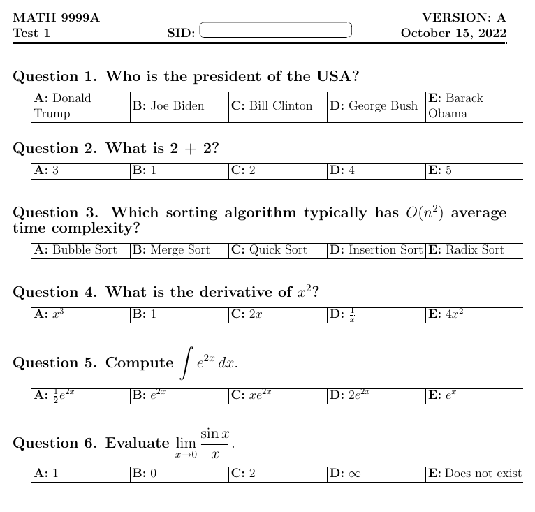

# Exam-Generator
A latex package enabled instructor to customize exam format and question contents, as well as permutation of chioces.
---
## **Preview**
* Formatting
*
* MC contents customizing
*.png)
* Permutation modifying
*.png)
*.png)
---
## **Features**
- **Student Features**:
  - Login and authentication function
  - Browse and search for available courses.
  - Enroll in courses, ensuring prerequisites are met.
    - View and manage personal course schedules.
